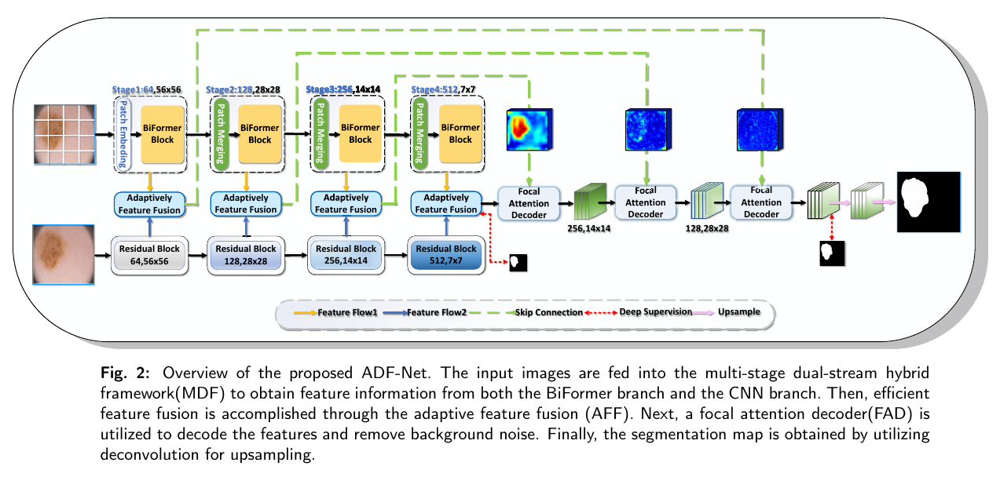

# TransFuse
This repo holds the code of ADF-Net

## Requirements
* Pytorch>=1.6.0, <1.9.0 (>=1.1.0 should work but not tested)
* timm==0.3.2

## Model Overview

      

In order to successfully upload, we remove the data and pre-trained weights.

1. Preparing necessary data:
	+ downloading ISIC2016\ISIC2017\ISIC2016 training, validation and testing data from the [official site](https://challenge.isic-archive.com/data), put the unzipped data in `./data`.
	+ run `process.py` to preprocess all the data, which generates `data_{train, val, test}.npy` and `mask_{train, val, test}.npy`.
2. Training:
    + downloading biformer_tiny_best.pth from (https://github.com/rayleizhu/BiFormer) to `./pretrained`.
    + downloading resnet-34 from [timm Pytorch](https://github.com/rwightman/pytorch-image-models/releases/download/v0.1-weights/resnet34-43635321.pth) to `./pretrained`.
    + The preparations are done, and we can start the training now.
    + run `AAtrain-deep.py`; you may also want to change the default saving path or other hparams as well.

